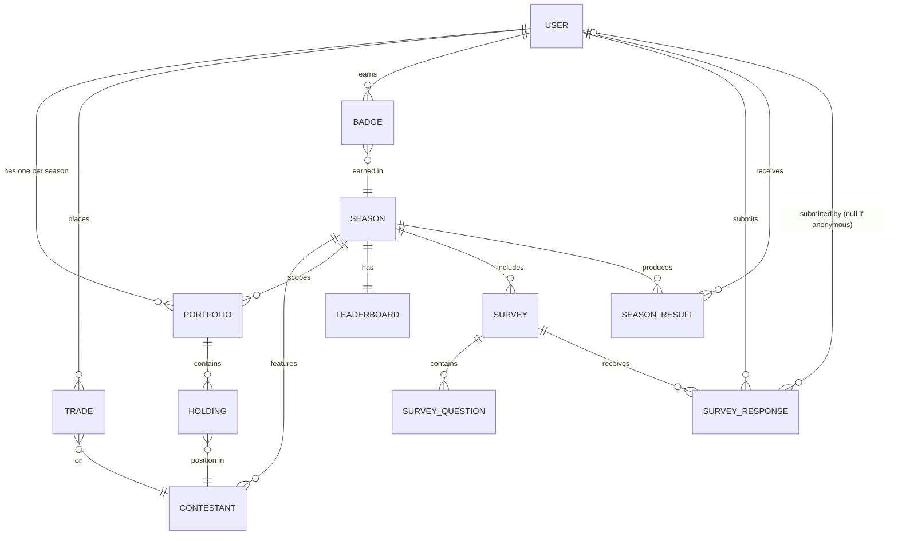
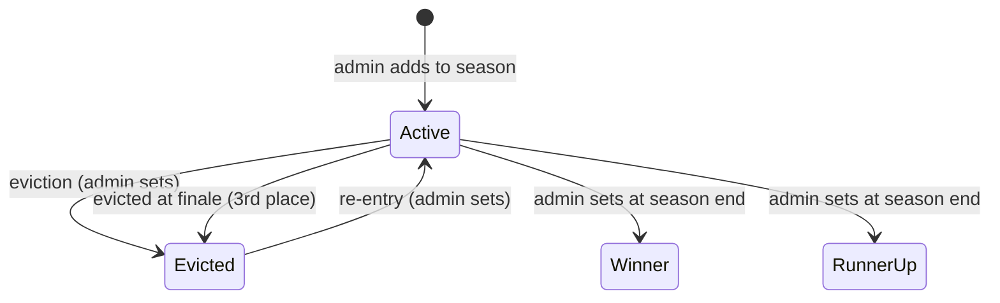
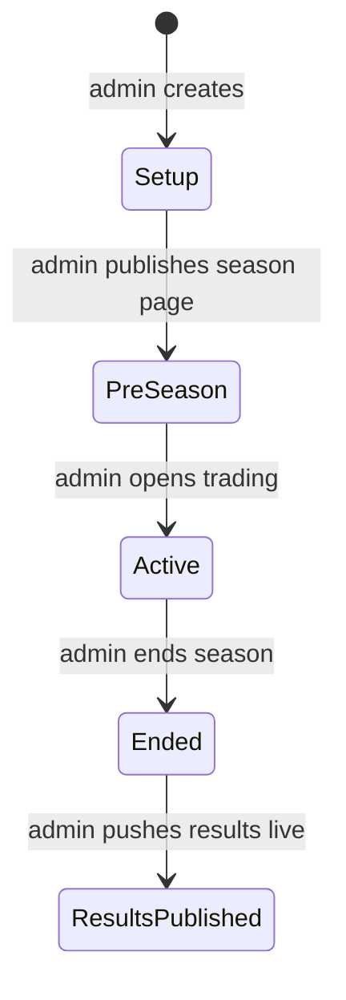
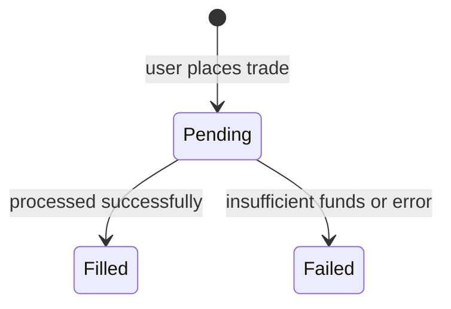
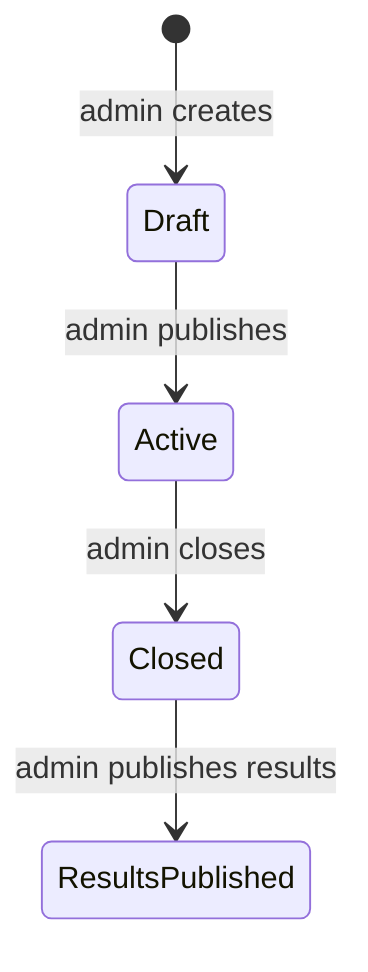

# Conceptual Model — Reality Stock Watch

*Session date: 2026-05-15. Framework: Layers of Product Design.*

---

## Object Definitions

### User
*A person with an account who participates in the game.*

| | |
|---|---|
| **Attributes** | username, email, avatar |
| **Relationships** | one Portfolio per Season · many Trades · many Badges · many Survey Responses · many Season Results |
| **Actions** | Register · Log in · Buy · Sell · Submit (survey response) · View (portfolio, leaderboard, results) |

---

### Season
*One discrete game instance corresponding to a BB season.*

| | |
|---|---|
| **Attributes** | name (e.g. "BB27"), start date, end date, status, starting balance, pricing constants (K, base price) |
| **Relationships** | many Contestants · many Portfolios · one Leaderboard · many Surveys · many Season Results |
| **Actions** | (admin) Create · Publish · Open · End · Push results live |

---

### Contestant
*A BB houseguest who is both a game character and a tradeable instrument within a season.*

| | |
|---|---|
| **Attributes** | name, photo, status, total shares outstanding · visual flags: HoH, Nominated, Veto (independent of status, no game impact) |
| **Relationships** | belongs to one Season · many Holdings · many Trades |
| **Actions** | (admin) Add · Set status · Set/clear visual flags · (user) Buy · Sell · View |

---

### Trade
*A record of a single buy or sell transaction on a contestant's stock.*

| | |
|---|---|
| **Attributes** | type (buy/sell), dollar amount, shares (fractional), price at execution, fee amount, state, timestamp |
| **Relationships** | belongs to one User · belongs to one Contestant |
| **Actions** | (user) Place · (system) Fill · (system) Fail |

---

### Holding
*A user's current position in a specific contestant — how many shares they own.*

| | |
|---|---|
| **Attributes** | shares held (fractional), average purchase price, liquidation value (derived) |
| **Relationships** | belongs to one User · belongs to one Contestant · belongs to one Portfolio |
| **Actions** | View · Sell (spawns a Trade) |

---

### Portfolio
*A user's complete financial state for a given season — cash plus all holdings.*

| | |
|---|---|
| **Attributes** | cash balance · net worth (derived: cash + sum of all holding liquidation values at current prices) |
| **Relationships** | belongs to one User · belongs to one Season · many Holdings |
| **Actions** | View |

> Net worth = what the user would receive if they sold 100% of all holdings simultaneously at current prices. Not shares × current price.

---

### Leaderboard
*Ranked standings of all users in a season by net worth.*

| | |
|---|---|
| **Attributes** | entries are derived (User + net worth + rank + badges) |
| **Relationships** | belongs to one Season · references many Users |
| **Actions** | View |

> Badges are displayed alongside leaderboard entries but belong to User, not Leaderboard.

---

### Season Result
*A snapshot of a user's final standing when a season ends — used to compute the all-time leaderboard.*

| | |
|---|---|
| **Attributes** | final rank, final net worth (snapshot), season |
| **Relationships** | belongs to one User · belongs to one Season |
| **Actions** | (system) Create on season end · (user) View on profile and all-time leaderboard |

> ⚠️ All-time leaderboard scoring logic TBD — currently "based on final rank per season," exact aggregation method (cumulative rank, average, points system) to be decided before building the all-time leaderboard.

---

### Badge
*A persistent achievement earned by a user at the end of a season.*

| | |
|---|---|
| **Attributes** | type (top-3, top-10), awarded at |
| **Relationships** | belongs to one User · associated with one Season |
| **Actions** | View (on profile and leaderboard) |

---

### Survey
*A weekly set of questions about the season, published by admin.*

| | |
|---|---|
| **Attributes** | title, week number, status, published at |
| **Relationships** | belongs to one Season · many Survey Questions · many Survey Responses |
| **Actions** | (admin) Create · Edit · Publish · Close · Publish results · (user) Submit response · View results · (anonymous) Submit response via public link |

---

### Survey Question
*An individual question within a survey.*

| | |
|---|---|
| **Attributes** | text, type (TBD — ranking, multiple choice, etc.), display order |
| **Relationships** | belongs to one Survey |
| **Actions** | (admin) Add · Edit · Reorder · Remove |

> ⚠️ Question types TBD — to be resolved before building the survey builder.

---

### Survey Response
*One person's complete set of answers to a survey.*

| | |
|---|---|
| **Attributes** | answers, submitted at, anonymous flag |
| **Relationships** | belongs to one Survey · optionally belongs to one User (null if anonymous) |
| **Actions** | Submit |

> Anonymous submissions are stored with a null User relationship. Results are visible to logged-in users only after admin publishes them.

---

## Object Map

---

## State Transitions

### Contestant

Visual flags (HoH, Nominated, Veto) are attributes toggled independently — not part of the state machine. They have no game impact; UI display only.

> ⚠️ TBD: Does trading halt when a contestant is marked Winner or Runner-up? Flag for follow-up before building end-of-season logic.

---

### Season

| State | Trading | Accounts | Contestants visible | Results |
|-------|---------|----------|-------------------|---------|
| Setup | No | No | No (admin only) | No |
| Pre-season | No | Yes | Yes | No |
| Active | Yes | Yes | Yes | No |
| Ended | No | Yes | Yes | No |
| Results Published | No | Yes | Yes | Yes |

> Pre-season: no "join game" button — any user with an account is automatically a participant when trading opens.

---

### Trade

> Beta: Pending resolves to Filled or Failed immediately — no visible queue. Pending becomes a real user-facing state only when the trade queue is introduced at scale.

---

### Survey

> ⚠️ Editing a Draft vs. editing an Active survey are different operations — changing questions after responses exist could corrupt data. Treat as separate interactions in the UI. Flag for interaction design.

---

## Ubiquitous Language

Use these terms consistently — in the UI, in help text, in API names, in internal conversation.

### Nouns

| Concept | Chosen term | Rejected alternatives | Decision |
|---------|------------|----------------------|----------|
| Person playing the game | **User** | Player, Member | Decided early — User is unambiguous |
| BB houseguest being traded | **Contestant** | Stock, Player, Houseguest | Reflects both BB identity and tradeable instrument — one object, not two |
| User's position in a contestant | **Holding** | Position, Stake, Investment | Neutral and clear |
| User's finances for a season | **Portfolio** | Account, Wallet | Standard, universally understood |
| In-app currency | **Cash** | Balance, Coins, Credits | Feels like money without implying real money |
| A buy or sell event | **Trade** | Order, Transaction | Active, game-appropriate |
| Season-end snapshot of rank | **Season Result** | Season Standing, Final Rank | Explicit about what it captures |

### Verbs

| Action | Chosen verb | Rejected | Applies to |
|--------|------------|----------|------------|
| Acquiring shares | **Buy** | Purchase, Invest, Acquire | Contestant stock |
| Disposing of shares | **Sell** | Liquidate, Dump | Contestant stock |
| Admin making season visible to players | **Publish** | Launch, Activate, Go live | Season (pre-season state), Survey, Survey results |
| Admin opening trading | **Open** | Start, Activate, Launch | Season (active state) |
| Admin closing season | **End** | Close, Finish, Wrap | Season |
| Admin setting contestant attribute | **Set** | Mark, Flag, Tag | HoH, Nominated, Veto, Evicted, Winner, Runner-up |

---

## Open Questions

- [ ] **Trading halt at season end** — does trading halt when a contestant is marked Winner or Runner-up? Resolve before building end-of-season logic.
- [ ] **All-time leaderboard scoring** — exact aggregation method TBD (cumulative rank, average rank, points system). Revisit before building all-time leaderboard.
- [x] **Survey question types** — Ranking, Multiple choice, Single choice.
- [ ] **Survey editing while active** — editing a Draft vs. an Active survey are different operations. Design as separate interactions to avoid corrupting in-flight responses.
- [ ] **Results visibility** — survey results visible to logged-in users only after admin publishes. Confirm whether any results are ever public.
