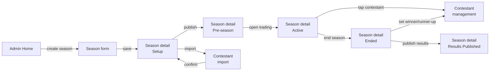
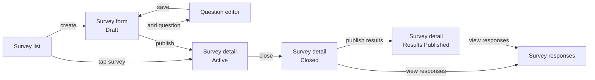

# Interaction Flow — Admin Panel

*Session date: 2026-05-15. Framework: Layers of Product Design.*

---

## Decisions made

- Admin panel is a protected section within the same app (e.g. `/admin`) — not a separate tool
- Admin access controlled by a simple `is_admin` flag on User — no role hierarchy in v1
- Admin panel is shared with the graph/survey project — unified admin, shared contestant data
- AI contestant scraping: admin enters source → AI extracts data → admin reviews and edits → confirms
- Survey question types: Ranking, Multiple choice, Single choice
- All season state transitions are manual admin actions with a confirmation step (high-stakes)

---

## Job stories

**Season setup:** When a new BB season starts, I want to get the season configured and contestants loaded so the game can go live for players.

**Contestant management:** When something happens in the BB house, I want to update contestant status and flags quickly so the app reflects the current game state.

**Survey builder:** When I want to gather fan opinions, I want to create, publish, and manage a weekly survey and share results at the right time.

---

## Breadboard

```
Admin Home
- Create new season → Season setup
- tap season row → Season detail
[ current season: name, state, quick actions ]
[ past seasons list ]

---

=== SEASON SETUP ===

Season setup — New season form
- Save → Season detail (setup state)
- Cancel → Admin home
[ season name (e.g. "BB27") ]
[ start date, end date ]
[ starting balance — LOCKS when trading opens, read-only after ]
[ pricing constants: K, base price — LOCKS when trading opens, read-only after ]
[ displayed as editable until Active state; shown as "Locked when trading opened" once Active ]

Season detail (setup state)
- Import contestants → Contestant import — Source entry
- tap contestant row → Contestant edit
- Delete contestant → confirmation → removed
- Publish to pre-season → confirmation → Season goes pre-season (visible to users)
- Edit season settings → Season setup form (pre-populated)
[ season name + state badge ]
[ contestant list: name, photo, status ]
[ empty state: "No contestants yet — import to get started" ]
[ Publish to pre-season disabled until at least one contestant added ]

Contestant import — Source entry
- Submit → Contestant import — Review
- Cancel → Season detail
[ "Enter a source for AI to extract contestant data" ]
[ text input: URL or season identifier (e.g. "Big Brother 27") ]

Contestant import — Review
- Edit field inline → updates that field
- Remove contestant row → removes from list
- Add contestant manually → appends blank row
- Confirm and save → Season detail (contestants added)
- Back → Source entry (re-run import)
[ extracted contestant list: name, photo, bio — editable inline ]
[ warning if any fields missing or low confidence ]

Contestant edit
- Save → Season detail
- Cancel → Season detail
[ name, photo (upload or URL), bio/stats ]
[ status — read only at setup, editable during active season ]

---

Season detail (pre-season state)
- Open trading → confirmation → Season goes active
- Import more contestants → Contestant import
- tap contestant → Contestant edit
- Edit season settings → Season setup form
[ season name + state badge: Pre-season ]
[ contestant list ]

Season detail (active state)
- End season → confirmation → Season goes ended
- tap contestant → Contestant management
[ season name + state badge: Active ]
[ contestant list: name, status, visual flags ]
[ live trading stats: total trades, total volume — informational ]

Season detail (ended state)
- Set winner → Contestant management (winner/runner-up assignment)
- Set runner-up → Contestant management
- Publish results → confirmation → Season goes Results Published
  (triggers: leaderboard lock, badge award, Season Results created)
[ season name + state badge: Ended ]
[ winner + runner-up not yet set warning if applicable ]
[ Publish results disabled until winner + runner-up are set ]

Season detail (results published state)
- (read only — season complete)
[ season name + state badge: Results Published ]
[ final leaderboard snapshot ]
[ winner + runner-up ]

---

=== CONTESTANT MANAGEMENT ===

Contestant management (admin view, active season)
- Set evicted → confirmation → status: Evicted
- Set re-entered → confirmation → status: Active
- Set winner → confirmation → status: Winner
- Set runner-up → confirmation → status: Runner-up
- Toggle HoH → on/off (no confirmation — low stakes, reversible)
- Toggle Nominated → on/off
- Toggle Veto → on/off
- Edit info → Contestant edit
- Back → Season detail
[ contestant name, photo ]
[ current status badge ]
[ visual flags: HoH / Nominated / Veto — toggles ]
[ status actions — contextual: only valid transitions shown ]
  [ active: Set evicted ]
  [ evicted: Set re-entered ]
  [ active (season ended): Set winner / Set runner-up ]

---

=== SURVEY BUILDER ===

Survey list (admin)
- Create new survey → Survey form — new
- tap survey row → Survey detail
[ all surveys for current season: title, week, status ]
[ past season surveys accessible via season filter ]

Survey form — new / edit
- Add question → Question editor
- reorder questions → drag to reorder
- tap question → Question editor (edit)
- remove question → confirmation → removed
- Save draft → Survey list (status: Draft)
- Publish → confirmation → survey goes Active, push notification sent to users
- Cancel → Survey list
[ survey title ]
[ week number ]
[ question list (ordered) ]
[ empty state: "No questions yet — add one to get started" ]
[ Publish disabled until at least one question added ]

Question editor — Ranking
- Save → Survey form
- Cancel → Survey form
[ question text ]
[ items to rank: add from contestant list OR enter custom items ]
[ reorder items ]

Question editor — Multiple choice
- Save → Survey form
- Cancel → Survey form
[ question text ]
[ options list: add, edit, remove ]
[ minimum / maximum selections (optional) ]

Question editor — Single choice
- Save → Survey form
- Cancel → Survey form
[ question text ]
[ options list: add, edit, remove ]

Survey detail (active)
- Edit → Survey form — edit (questions locked — only title editable while active)
- Close survey → confirmation → survey goes Closed
[ survey title, week, status ]
[ response count (live) ]
[ close date/time if set ]

Survey detail (closed)
- View responses → Survey responses
- Publish results → confirmation → survey goes Results Published, push notification sent
[ survey title, week, status: Closed ]
[ total responses: logged-in + anonymous counts ]

Survey responses (admin)
- Back → Survey detail
[ full response data ]
[ graph visualization ]
[ filter: all / logged-in / anonymous ]
[ past surveys accessible — admin only ]

Survey detail (results published)
- View responses → Survey responses
[ survey title, week, status: Results Published ]
[ results are now visible to logged-in users ]
```

---

## Flow diagram — Season lifecycle



---

## Flow diagram — Survey builder



---

## Open decisions

- [x] **Pricing constants hard lock** — `K` and `base_price` are locked the moment trading opens (season goes Active). Changing these mid-season would invalidate the formula for all existing holdings. This is a hard lock in the UI — fields become read-only and cannot be overridden, even by admin. Display a clear label: "Locked when trading opened." Starting balance locks at the same point for the same reason. Season name and dates remain editable throughout.
- [ ] **Contestant import re-run** — if admin re-runs AI import mid-setup, does it merge with existing contestants or replace? Suggest merge with conflict review.
- [ ] **Survey editing while active** — only title editable once active (questions locked to protect response integrity). Confirm this is the right constraint.
- [ ] **Survey close date/time** — can admin set an automatic close time, or always manual? Auto-close + manual override recommended.
- [ ] **Ranking question source** — can pull from season contestant list (auto-populated) OR use custom items. Confirm both are needed.
- [ ] **Response count visibility** — admin sees live response count on active survey. Does this include a breakdown by logged-in vs. anonymous? Useful for understanding reach.
- [ ] **Admin access to past season surveys** — confirmed admin can view past surveys. Is edit/republish of past surveys ever needed, or view-only?
- [ ] **Winner/runner-up required before publishing results** — Publish results blocked until both are set. Confirm this hard gate is correct.
