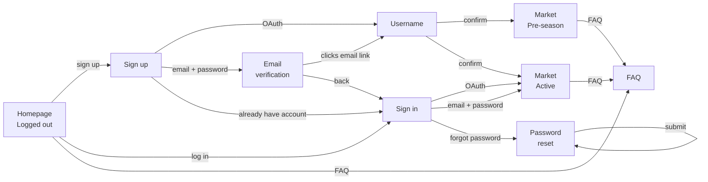

# Interaction Flow — Onboarding

*Session date: 2026-05-15. Framework: Layers of Product Design.*

---

## Job story

When I hear about Reality Stock Watch from the RHAP community, I want to get set up and understand what I'm looking at so I can start trading before I miss too much of the season.

---

## Decisions made

- Auth: Google OAuth + Apple OAuth + email/password (all via Supabase native)
- OAuth email collision: Supabase links accounts automatically if same email used across providers
- Username: auto-generated at signup, unlimited shuffles, **permanent — cannot be changed after confirming**
- Email verification required for email/password signups (Supabase default)
- Starting balance shown exactly on pre-season market first visit
- Logged-out homepage: simple marketing page, season-aware, login/signup CTAs. Marketing copy TBD.
- Mid-season joins: no forced orientation — trust the RHAP audience
- FAQ: accessible from global nav and account settings at any time, not a required onboarding step
- Username screen is not dismissable — required before entering the app

---

## Breadboard

```
Homepage (logged out)
- Sign up → Sign up
- Log in → Sign in
- FAQ → FAQ
[ hero: what is Reality Stock Watch ]
[ current season status or teaser ]
[ login / signup CTAs ]

---

Sign up
- Continue with Google → Username (first time)
- Continue with Apple → Username (first time)
- Submit email/password → Email verification
- Already have account → Sign in
[ Google OAuth button ]
[ Apple OAuth button ]
[ email + password inputs ]
[ error: "An account with this email already exists — log in instead" ]

---

Sign in
- Continue with Google → Market (returning user)
- Continue with Apple → Market (returning user)
- Submit email/password → Market (returning user)
- No account → Sign up
- Forgot password → Password reset
[ Google OAuth button ]
[ Apple OAuth button ]
[ email + password inputs ]
[ invalid credentials error: inline ]

---

Password reset
- Submit → Password reset sent
- Back → Sign in
[ email input ]

Password reset sent
- Back to sign in → Sign in
[ "Check your email for a reset link" ]
[ Resend ]

---

Email verification
- (user clicks link in email) → Username
- Resend → resends (stays on screen)
- Back to sign in → Sign in
[ "Check your email — we sent a link to [email]" ]
[ Resend link ]

---

Username
- Shuffle → regenerates username (stays on screen, instant, unlimited)
- Confirm → Market (pre-season or active, based on current season state)
[ "Your username is [auto-generated]" ]
[ Shuffle button ]
[ "This username is permanent — choose one you like" ]
[ not dismissable — required before entering app ]

---

Market — Pre-season (first visit)
[ cast grid: contestant photo, name, starting price ]
[ "Trading opens [date]" ]
[ starting balance: "You'll have $X.XX to trade when the season opens" ]
[ FAQ in global nav ]

---

Market — Active (mid-season first visit)
[ live contestant list with prices ]
[ cash balance: starting balance, nothing deployed ]
[ FAQ in global nav ]

---

FAQ
- back → wherever user came from
[ game rules and questions ]
[ accessible from global nav and account settings at any time ]
```

---

## Flow diagram



---

## Open decisions

- [x] Username shuffle — unlimited
- [x] Username — permanent, cannot be changed after confirming
- [x] OAuth email collision — Supabase links accounts automatically
- [x] Starting balance — shown exactly on pre-season first visit
- [x] Apple OAuth — included
- [ ] **Homepage copy** — marketing language TBD. Needs: headline, one-line description, season status display (active season vs. off-season state)
- [ ] **Username format** — hybrid recommended: BB-themed noun + 4-digit number (e.g. `Block_4821`, `Veto_2947`, `Feeds_1103`). ~60–70 BB words × 10,000 = 700k combinations, sufficient at any realistic scale. Concern: too limiting if word list is small — curate carefully. Full generic words also on the table.
- [ ] **Bad word filtering on username generator** — needs a blocklist. Standard open-source lists available.
