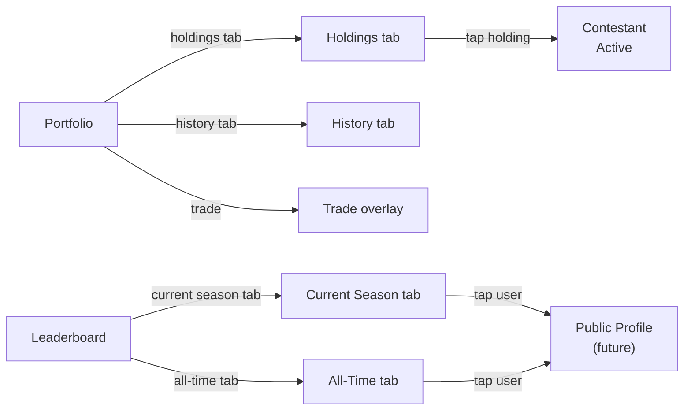

# Interaction Flow — Portfolio & Leaderboard

*Session date: 2026-05-15. Framework: Layers of Product Design.*

---

## Job stories

**Portfolio:** When I want to review my positions, I want to see what I'm holding and what trades I've made so I can decide what to do next.

**Leaderboard:** When I want to see how I stack up, I want to find my rank and compare with other fans so I can brag in Discord or push to improve.

---

## Decisions made

- Portfolio and Leaderboard are separate top-level nav destinations
- Portfolio has two tabs: Holdings (default) and History
- Portfolio top: net worth + cash balance + total gain/loss vs. starting balance (e.g. "Net worth $1,247 · Started with $1,000 · +$247 (+24.7%)"). Do not use "P&L" — finance jargon, not appropriate for a casual game audience.
- Trade history shown — full log of filled trades only (failed trades not shown)
- History pagination: explicit "Load more" button, not infinite scroll
- Leaderboard is paginated — no full list load (prior app had load issues with this)
- Leaderboard has search by username
- Leaderboard — "Find me": a filter that pins and highlights the user's own row with a distinct visual treatment. Not a search — a one-tap action.
- Leaderboard tabs: Current Season + All-Time
- All-Time filterable by specific completed season (current incomplete season excluded)
- When current season ends, Current Season tab is hidden — only All-Time shown
- Badges: all badges shown on leaderboard rows, each badge carries its season number (e.g. top-3 badge for BB27). Badges are season-specific.

---

## Breadboard

```
Portfolio
[ net worth + cash balance — pinned at top ]
- tab: Holdings (default)
- tab: History
- Trade → Trade overlay

  Portfolio — Holdings tab
  - tap holding row → Contestant (active)
  [ list: contestant, shares held, avg purchase price, liquidation value, gain/loss on this holding ]
  [ empty state: "No holdings yet — buy your first Contestant shares to get started" ]

  Portfolio — History tab
  - load more → appends next page (explicit button, not infinite scroll)
  [ chronological trade list: type (buy/sell), contestant, shares, execution price,
    dollar amount, fee, timestamp ]
  [ empty state: "No trades yet" ]

---

Leaderboard
[ tab: Current Season — hidden when season has ended ]
[ tab: All-Time — default when season has ended ]

  Leaderboard — Current Season
  - "Find me" → pins and highlights own row with distinct visual treatment
  - search by username → filters list inline
  - load more → appends next page (explicit button)
  - tap user row → (Public Profile — future flow)
  [ ranked list: rank, username, net worth, all badges (each labelled with season number) ]
  [ own row: distinct visual treatment when "Find me" active ]
  [ search: empty results state: "No users found for '[query]'" ]
  [ empty state (early beta): "No players yet — be the first to trade" ]

  Leaderboard — All-Time
  - season filter → filters list (all seasons / specific completed season)
  - "Find me" → pins and highlights own row with distinct visual treatment
  - search by username → filters list inline
  - load more → appends next page (explicit button)
  - tap user row → (Public Profile — future flow)
  [ ranked list: rank, username, all badges (each labelled with season number), seasons played ]
  [ season filter: "All seasons" default · completed seasons only in dropdown ]
  [ search + filter combinable ]
  [ empty results state: "No results" ]
```

---

## Flow diagram



---

## Open decisions

- [x] "Find me" — filter that pins + highlights own row, distinct visual treatment
- [x] Portfolio top stat — net worth + total gain/loss vs. starting balance in plain language (no "P&L")
- [x] Trade history — filled trades only, explicit load more
- [x] Badges — all badges shown, each labelled with season number
- [ ] **Public Profile flow** — future. Leaderboard user rows link here but flow not yet designed.
- [ ] **Badge visual design** — how does a season number appear on a badge? Number overlay, separate label, tooltip? Surface decision.
- [ ] **"Find me" behaviour when not in top N** — user is rank #312 and list shows top 25. Does "Find me" jump to page containing their rank, or insert their row inline at the top with a separator? Both are valid patterns.
