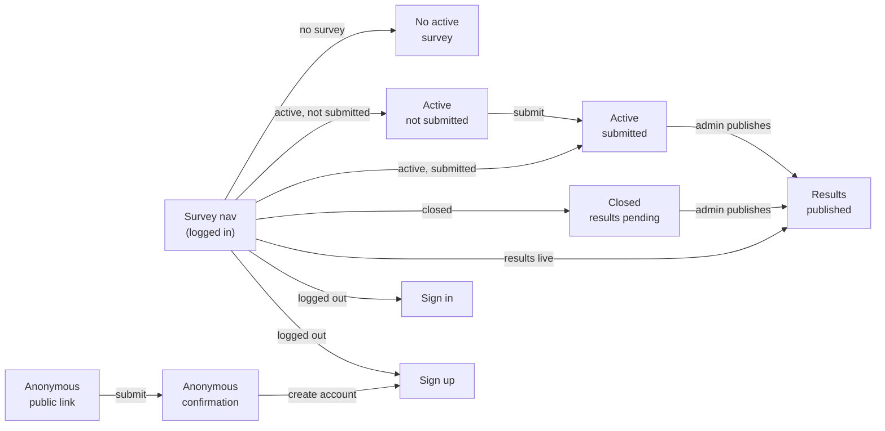

# Interaction Flow — Survey (User-facing)

*Session date: 2026-05-15. Framework: Layers of Product Design.*

---

## Job story

When a new weekly survey drops, I want to share my takes on the season and see how my opinions compare with other fans.

---

## Decisions made

- Survey is a top-level nav item — always present, always reflects current state
- One active survey at a time — no survey list for users (admin can access past surveys)
- Survey page is a single place with multiple states (not separate pages per state)
- Graph visualization is embedded in the results state of the same survey page
- Submission is an inline state change — no separate confirmation page
- Results visible to logged-in users only, after admin publishes
- Submitted answers ("Your picks") shown to the submitting user below the graph on results state
- Anonymous submission via public link — completely detached standalone experience: no global nav, no app chrome, no connection to the main app UI. Intentional — anonymous users are not app users.
- Anonymous users prompted to create an account on confirmation, not forced
- Anonymous public link after survey closes: shows "Survey closed" message — no redirect
- Admin controls result publication timing — not automatic on close
- Push notification triggers: (1) survey goes live, (2) results published, (3) reminder 1 hour before survey closes

---

## Breadboard

```
Survey page — No active survey
[ "No survey right now — check back soon" ]
[ most recent published results still visible if applicable ]

---

Survey page — Active (not yet submitted)
- submit → Survey page transitions to Submitted state (inline)
[ survey title + week number ]
[ questions (type TBD) ]
[ submit button ]

---

Survey page — Active (already submitted)
[ "Thanks for your response — results will be posted soon" ]
[ your submitted answers — read only ]

---

Survey page — Closed, results pending
[ "Survey closed — check back soon for results" ]
[ your submitted answers if you submitted — read only ]
[ no answers section if you didn't submit ]

---

Survey page — Results published
[ survey title + week number ]
[ graph visualization — embedded ]
[ "Your picks" — your submitted answers below graph ]
[ no "Your picks" section if user didn't submit ]

---

Survey — Anonymous (public link, standalone — no app nav or chrome)
- submit → Anonymous confirmation
[ survey title ]
[ questions ]
[ submit button ]
[ no navigation, no app header, no links into the app ]

Survey — Anonymous, survey closed (public link accessed after close)
[ "This survey is closed" ]
[ no navigation, no app links ]

Survey — Anonymous confirmation (standalone)
- Create account → Sign up (exits standalone, enters app onboarding)
- dismiss → page ends / nothing
[ "Response submitted" ]
[ "Want to see the results? Create an account." ]
[ no navigation ]

---

Survey page — Logged out (nav access within app)
- Log in → Sign in
- Sign up → Sign up
[ "Log in to take the survey and see results" ]
[ note that a public link exists for anonymous submission if survey is active ]
```

---

## Flow diagram



---

## Open decisions

- [x] Push notification triggers — survey live, results published, reminder 1 hour before close
- [x] Anonymous public link after close — "Survey closed" message, no redirect
- [x] Anonymous experience — fully standalone, no app nav or chrome
- [x] **Survey question types** — `ranking`, `multiple_choice`, `single_choice` (enum in `0001_initial_schema.sql`). All three implemented in `components/survey/{Ranking,Choice}.tsx`.
- [x] **Most recent results on "no active survey" state** — decided NOT to show. Empty-state-only ("No survey right now — check back soon"). #41 ships this behavior.
- [x] **Anonymous → Sign up handoff** — decision: carry over (anonymous response becomes tied to the new user on signup). Implementation deferred — needs a signed cookie binding the anonymous response to the upcoming session + an onboarding hook to consume it. Tracked as a follow-up.

## Shipped

Implemented in #41 (PR #76). See:
- Logged-in route: `app/(app)/survey/page.tsx` + `components/survey/SurveyView.tsx`
- Anonymous route: `app/survey/[id]/public/{page,layout}.tsx`
- Server actions: `lib/survey/actions.ts` (logged-in via RLS; anonymous via service-role client)
- Data loader: `lib/survey/source.ts` (`getSurveyPageState` returns a discriminated union over the 5 states)
