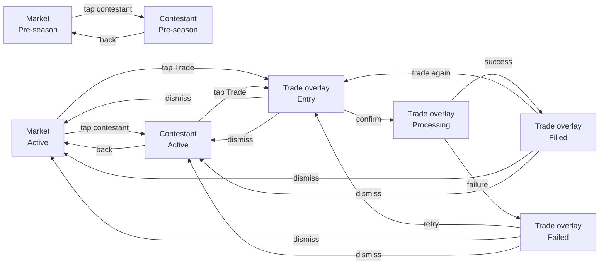

# Interaction Flow — Trading

*Session date: 2026-05-15. Framework: Layers of Product Design.*

---

## Job story

When I want to act on my read of the BB game, I want to buy or sell contestant shares quickly so I can put my reads on the line and get back to watching.

---

## Decisions made

- Trade initiated from market list via single "Trade" button (not separate Buy/Sell on row)
- Trade Entry is a **generic overlay** — not tied to a specific contestant, not a navigation destination
- Contestant is selected inside the overlay — pre-populated when opened from a row or detail page, but always changeable
- One contestant per trade — no multi-contestant basket orders (each contestant has independent bonding curve pricing; simultaneous slippage calculation adds complexity for no real benefit)
- Overlay is not dependent on what's beneath it — manages its own contestant selection state internally
- Buy/Sell is a toggle inside the overlay — one place, not two
- Execution is at-market — result screen shows actual vs. preview price if they differ
- Insufficient funds: confirm and fail with error message (not real-time input blocking)
- Sell toggle disabled (not hidden) when user has no holding in selected contestant
- Partial sells allowed — max sell amount = current liquidation value of full holding
- "Sell all" shortcut fills input with full liquidation value
- Evicted contestant: no special warning in trade overlay — eviction is a visual flag only
- Pre-season market: shows cast grid with starting prices, no trade actions

---

## Breadboard

```
Market — Pre-season
- tap contestant card → Contestant (pre-season)
[ cast grid: contestant photo, name, starting price ]
[ "Trading opens [date]" — countdown or status message ]
[ cash balance: starting balance, not yet deployed ]
[ no trade actions — read only ]

---

Market — Active
- tap contestant row → Contestant (active)
- tap Trade on contestant row → Trade overlay — Entry (buy default)
[ live list: contestant name, current price, 24h change, your holding per contestant ]
[ cash balance ]
[ prices update when trades change contestant supply — subtle update animation ]

---

Contestant — Pre-season
- back → Market (pre-season)
[ photo, name, bio/stats ]
[ starting price ]
[ no trade button ]

---

Contestant — Active
- back → Market (active)
- Trade → Trade overlay — Entry (persists if already open; background transitions)
[ photo, name, status badge ]
[ visual flags: HoH / Nominated / Veto / Evicted — display only ]
[ live price + price movement ]
[ your holding: shares held, avg purchase price, liquidation value, gain/loss in plain language ]
[ empty holding state: "You don't own any shares in [name]" ]

---

Trade overlay — Entry
- Confirm → Trade overlay — Processing
- Dismiss → wherever user came from
[ contestant selector — pre-populated if opened from a row or detail page, always changeable ]
[ selected contestant: name + live price ]
[ Buy / Sell toggle ]
  [ Sell tab: disabled if no holding in selected contestant ]
[ dollar amount input ]
  [ Buy mode: max = cash balance ]
  [ Sell mode: max = liquidation value · "Sell all" shortcut fills input instantly ]
[ preview: fractional shares received/given, first share price → last share price, total cost/proceeds ]
[ Buy mode footer: cash balance ]
[ Sell mode footer: current holding value ]
[ Confirm enabled at any input amount — fails at execution if insufficient ]

---

Trade overlay — Processing
→ auto-transitions to Filled or Failed
[ processing indicator ]
[ no user actions while processing ]

---

Trade overlay — Filled
- Trade again → Trade overlay — Entry (inputs reset, same contestant)
- Dismiss → Market or Contestant
[ ✓ Trade filled ]
[ shares bought/sold, final execution price ]
[ price shifted: "Executed at $X.XX · Preview was $Y.YY" — shown only if price moved ]
[ updated cash balance (buy) or updated holding (sell) ]

---

Trade overlay — Failed
- Retry → Trade overlay — Entry (inputs preserved)
- Dismiss → Market or Contestant
[ ✗ Trade failed ]
[ Insufficient funds: "Not enough cash — adjust your amount" ]
[ Server/network error: "Something went wrong — your trade was not placed" ]
```

---

## Flow diagram



---

## Open decisions

- [ ] **Partial sells** — user can sell any dollar amount up to their full holding's liquidation value. Max input in sell mode = current liquidation value. ⚠️ Confirm this is the intended behavior before building.
- [ ] **Global Trade button** — generic overlay can be triggered from anywhere. Consider a persistent FAB or nav action so users can trade without navigating to a specific contestant first. Surface decision.
- [ ] **Contestant selector UX** — inside the overlay, how does the user pick/change a contestant? Dropdown, search, scrollable list? Surface decision.
- [ ] **Price update animation** — prices update when Realtime contestant supply changes. Subtle flash/fade on update. Style TBD at surface layer.
- [ ] **Trade button placement on list row** — single "Trade" button. Where on the row? Rightmost affordance recommended but surface decision.
- [ ] **Price shift threshold** — show "Executed at / Preview was" message only if delta exceeds X%. Avoids noise on tiny movements. Threshold TBD.

---

## Risks

- Generic overlay manages its own contestant selection state — must handle the case where the pre-populated contestant changes (e.g. user switches contestant mid-flow). Preview must recalculate on contestant change.
- At-market execution means the preview and result can differ. If the difference is large, users may feel misled. The "Executed at / Preview was" message is necessary but may need a threshold (only show if delta exceeds X%) to avoid noise on tiny movements.
- Partial sells require knowing liquidation value in real time — derived calculation dependent on current supply, must be computed server-side on demand, not cached.
- Live price inside the overlay — price freezes when user begins interacting with the input. Trade executes at-market regardless. Any price movement is surfaced in the Filled/Failed result message, not during composition.
